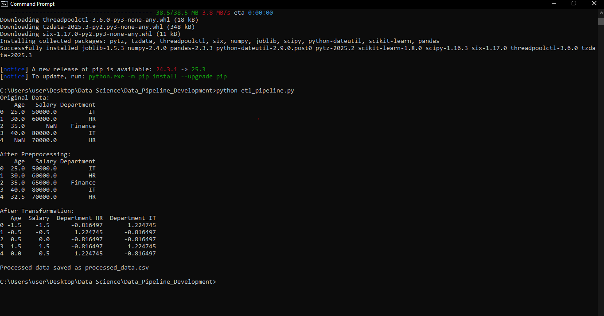

# Data Pipeline Development

Company Name: CODTECH IT Solutions  
Name: Hamsa Varshini S  
Intern ID: CT04DR2747
Domain: Data Science  
Duration: December 1st,
2025 to January 1st, 2026
Mentor: Neela Santhosh Kumar  

## Task Description

This project focuses on building an automated data pipeline using Python
to demonstrate the ETL (Extract, Transform, Load) process. The goal of this
task is to preprocess, transform, and load data using industry-standard
libraries such as pandas and scikit-learn.

In the extract phase, a CSV dataset was loaded using the pandas library.
The dataset contained both numerical and categorical features along with
missing values. Pandas provided an efficient and readable way to inspect
and manage the raw data.

During the preprocessing stage, missing numerical values were handled by
replacing them with the mean of their respective columns. Missing
categorical values were filled using the mode, ensuring data consistency
without losing important information.

In the transformation stage, categorical variables were converted into
numerical format using one-hot encoding. Feature scaling was then applied
using StandardScaler from scikit-learn to normalize the dataset and prepare
it for further analysis or machine learning tasks.

Finally, the processed data was saved as a new CSV file, completing the
load phase of the pipeline. This automated ETL pipeline demonstrates a
real-world data preprocessing workflow commonly used in data science
projects.

## Tools Used
- Python  
- Pandas  
- Scikit-learn  
- Visual Studio Code  

## Output

